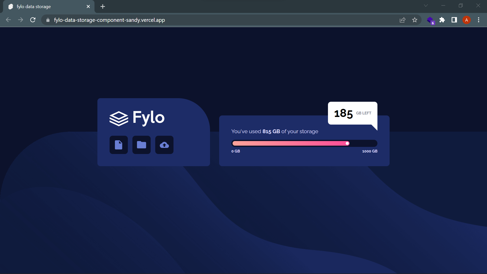

# Frontend Mentor - Fylo data storage component solution

This is a solution to the [Fylo data storage component challenge on Frontend Mentor](https://www.frontendmentor.io/challenges/fylo-data-storage-component-1dZPRbV5n)
Frontend Mentor challenges help you improve your coding skills by building realistic projects.

## Table of contents

- [Overview](#overview)
  - [The challenge](#the-challenge)
  - [Screenshots](#screenshot)
  - [Links](#links)
- [My process](#my-process)
  - [Built with](#built-with)
  <!-- - [What I learned](#what-i-learned)
  - [Continued development](#continued-development) -->
  - [Useful resources](#useful-resources)
- [Author](#author)
<!-- - [Acknowledgments](#acknowledgments) -->

## Overview

### The challenge

Users should be able to:

- View the optimal layout for the site depending on their device's screen size

### Screenshots

### Links

<!-- - Solution URL: [Add solution URL here](https://your-solution-url.com)
- Live Site URL: [Add live site URL here](https://your-live-site-url.com) -->

## My process

### Built with

- Mobile-first workflow
- [SvelteKit](https://kit.svelte.dev/) - JS framework
- [Tailwindcss](https://tailwindcss.com/) - utility-first CSS framework for styles

### Useful resources

- [Tailwind CSS official documentation](https://tailwindcss.com/docs/guides/sveltekit)
- [Svelte official tutorial](https://svelte.dev/tutorial/basics)
- [Svelte official documentation](https://svelte.dev/docs)
- [SvelteKit official documentation](https://kit.svelte.dev/docs/introduction)

## Author

<!-- - Website - [Achraf Kamel](https://dev.AK-97.me) -->
- Frontend Mentor - [@AchrafKamel](https://www.frontendmentor.io/profile/AchrafKamel)
- Freecodecamp - [@ak-97](https://www.freecodecamp.org/ak-97)
- Linkedin - [@achraf-kamel](https://www.linkedin.com/in/achraf-kamel/)
- Twitter - [@Achraf_Kamel_97](https://twitter.com/Achraf_Kamel_97)